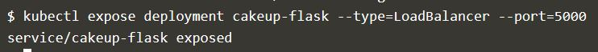

# Ujian Akhir Semester Teknologi Cloud Computing  

## Apa itu Kubernetes ?  
Kubernetes merupakan platform open-source yang digunakan untuk melakukan manajemen workloads aplikasi yang dikontainerisasi, serta menyediakan konfigurasi dan otomatisasi secara deklaratif.  

## Komponen - Komponen Pada Kubernetes  
### Komponen Master  
Komponen master menyediakan control plane bagi klaster. Komponen ini berperan dalam proses pengambilan secara global pada klaster, serta berperan dalam proses deteksi serta pemberian respons terhadap events yang berlangsung di dalam klaster. Komponen master dapat dijalankan di mesin manapun yang ada di klaster, untuk memudahkan proses yang ada, script inisiasi awal yang dijalankan biasanya memulai komponen master pada mesin yang sama, serta tidak menjalankan kontainer bagi pengguna di mesin ini.  

kube-apiserver  
Komponen di master yang mengekspos API Kubernetes. Merupakan front-end dari kontrol plane Kubernetes. Komponen ini didesain agar dapat di-scale secara horizontal.

etcd  
Penyimpanan key value konsisten yang digunakan sebagai penyimpanan data klaster Kubernetes.  

kube-scheduler  
Komponen di master yang bertugas mengamati pod yang baru dibuat dan belum di-assign ke suatu node dan kemudian akan memilih sebuah node dimana pod baru tersebut akan dijalankan.
Faktor-faktor yang diperhatikan dalam proses ini adalah kebutuhan resource secara individual dan kolektif, konstrain perangkat keras/perangkat lunak/peraturan, spesifikasi afinitas dan non-afinitas, lokalisasi data, interferensi inter-workload dan deadlines.  

kube-controller-manager
Komponen di master yang menjalankan kontroler. Secara logis, setiap kontroler adalah sebuah proses yang berbeda, tetapi untuk mengurangi kompleksitas, kontroler-kontroler ini dikompilasi menjadi sebuah binary yang dijalankan sebagai satu proses. Kontroler-kontroler ini meliputi:  
Kontroler Node : Bertanggung jawab untuk mengamati dan memberikan respons apabila jumlah node berkurang.  
Kontroler Replikasi : Bertanggung jawab untuk menjaga jumlah pod agar jumlahnya sesuai dengan kebutuhan setiap objek kontroler replikasi yang ada di sistem.  
Kontroler Endpoints : Menginisiasi objek Endpoints (yang merupakan gabungan Pods dan Services).  
Kontroler Service Account & Token: Membuat akun dan akses token API standar untuk setiap namespaces yang dibuat.  

cloud-controller-manager
Merupakan kontroler yang berinteraksi dengan penyedia layanan cloud. Adanya cloud-controller-manager memungkinkan kode yang dimiliki oleh penyedia layanan cloud dan kode yang ada pada Kubernetes saling tidak bergantung selama masa development. Kontroler berikut ini memiliki keterkaitan dengan penyedia layanan cloud:
Kontroler Node : Melakukan pengecekan pada penyedia layanan cloud ketika menentukan apakah sebuah node telah dihapus pada cloud apabila node tersebut berhenti memberikan respons.
Kontroler Route : Melakukan pengaturan awal route yang ada pada penyedia layanan cloud
Kontroler Service : Untuk membuat, memperbaharui, menghapus load balancer yang disediakan oleh penyedia layanan cloud
Kontroler Volume : Untuk membuat, meng-attach, dan melakukan mount volume serta melakukan inetraksi dengan penyedia layanan cloud untuk melakukan orkestrasi volume.  

### Komponen Node  

Komponen ini ada pada setiap node, fungsinya adalah melakukan pemeliharaan terhadap pod serta menyediakan environment runtime bagi Kubernetes.
kubelet
Agen yang dijalankan pada setiap node di klaster dan bertugas memastikan kontainer dijalankan di dalam pod.
kube-proxy
Membantu abstraksi service Kubernetes melakukan tugasnya.
Container Runtime
Container runtime adalah perangkat lunak yang bertanggung jawab dalam menjalankan kontainer.

### Addons  
Addons merupakan pod dan service yang mengimplementasikan fitur-fitur yang diperlukan klaster.  
DNS
Meskipun tidak semua addons dibutuhkan, semua klaster Kubernetes hendaknya memiliki DNS klaster. Komponen ini penting karena banyak dibutuhkan oleh komponen lainnya.  
Klaster DNS adalah server DNS, selain beberapa server DNS lain yang sudah ada di environment kamu, yang berfungsi sebagai catatan DNS bagi Kubernetes services
Kontainer yang dimulai oleh kubernetes secara otomatis akan memasukkan server DNS ini ke dalam mekanisme pencarian DNS yang dimilikinya.
Web UI (Dasbor)  
Dasbor adalah antar muka berbasis web multifungsi yang ada pada klaster Kubernetes. Dasbor ini memungkinkan user melakukan manajemen dan troubleshooting klaster maupun aplikasi yang ada pada klaster itu sendiri.  
Container Resource Monitoring  
Container Resource Monitoring mencatat metrik time-series yang diperoleh dari kontainer ke dalam basis data serta menyediakan antar muka yang dapat digunakan untuk melakukan pencarian data yang dibutuhkan.  
Cluster-level Logging  
Cluster-level logging bertanggung jawab mencatat log kontainer pada penyimpanan log terpusat dengan antar muka yang dapat digunakan untuk melakukan pencarian.

## Deployment menggunakan Kubernetes  
Sebelum deployment, maka buat aplikasi terlebih dahulu menggunakan pyhton. Buat 1 Folder yang berisi aplikasi, Paket python, dan Docker file yang akan menjadi image.  
1. app.py  
```  
# app.py - a minimal flask api using flask_restful
from flask import Flask
from flask_restful import Resource, Api

app = Flask(__name__)
api = Api(app)

class HelloWorld(Resource):
    def get(self):
        return {'Hai': 'Khanif'}

api.add_resource(HelloWorld, '/')

if __name__ == '__main__':
    app.run(debug=True, host='0.0.0.0')  
```  

2. requirements.txt  
file yang berisi paket python  
```  
flask
flask_restful
```  

3. DockerFile  
Yang berisi perintah untuk memanggil komponen yang ada didalamnya untuk dirakit menjadi docker images.  
```
FROM python:2.7
COPY . /app
WORKDIR /app
RUN pip install -r requirements.txt
ENTRYPOINT ["python"]
CMD ["app.py"]
```  
Setelah Selesai membuat docker image, push ke docker hub lalu kemudian deploy dengan perintah :    

1.   Membuat Deployment untuk image yang sudah dibuat  
Menggunakan perintah ``` kubectl create ``` untuk membuat Deployment 
```  
$ kubectl create deployment kub-flask --image=khanifeka/khanif-flask:v1
```  
Output  
   

2. Melihat Deployment  
``` 
$ kubectl get deployments  
NAME           READY   UP-TO-DATE   AVAILABLE   AGE
cakeup-flask   1/1     1            1           49s  
```
3. Melihat Pods  

```  
$ kubectl get pods
NAME                            READY   STATUS    RESTARTS   AGE
cakeup-flask-5c8b5d89dd-44587   1/1     Running   0          87s  
```  
4. Membuat Layanan / Service  
Secara default, Pod hanya bisa diakses melalui alamat IP internal di dalam klaster Kubernetes. Supaya Kontainer bisa diakses dari luar jaringan virtual Kubernetes, maka harus ekspos Pod sebagai Servis Kubernetes.  
```
$ kubectl expose deployment cakeup-flask --type=LoadBalancer --port=5000
```    
Output  
  

5. Melihat Layanan yang sudah dibuat  
```  
$ kubectl get service  
NAME           TYPE           CLUSTER-IP      EXTERNAL-IP   PORT(S)          AGE
cakeup-flask   LoadBalancer   10.96.60.101    <pending>     5000:31545/TCP   40s
kub-flask      LoadBalancer   10.96.160.239   <pending>     8000:31204/TCP   26m
kubernetes     ClusterIP      10.96.0.1       <none>        443/TCP          31m  
```  

Display Port pada Browser  
  


175410074  
Khanifa Eka Nuryati

